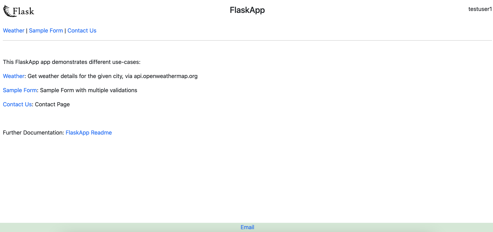

# Flask Application

## 1. Overview
This Flask application demonstrates different use-cases:
- Weather: Get weather details for the given city, via api.openweathermap.org.
- Sample Form: Sample Form with multiple validations.
- Contact Us: Contact Page that takes user-input and sends email with the given content. Uses sendinblue API to send the email.

## 2. Code Structure

- Application: main app code is in app.py and other scripts in main directory for different use-cases.
- templates: html templates.
- static: images, css and js code.

## 3. Pre-requisites
- Create a free openweathermap.org account and get your weather API key from https://home.openweathermap.org/api_keys.
- Create a free sendinblue account and get your sendinblue API key from https://app.sendinblue.com/settings/keys/api.
- Create localsecrets.py file in the same folder as this flask-app with below content:
```
APIKEY_WEATHER="YOURWEATHERAPIKEY"
APIKEY_SENDINBLUE="YOURSENDINBLUEAPIKEY"
```
- Install application pre-req packages: ```pip3 install -r requirements.txt```
- Update 'devopscontact' email in [config.py](config.py).
- Update email recipient details in [contactus.py](contactus.py).

## 4. How to run
- In a development environment, you can run this app:
```
./app.py
```

OR

```
python3 app.py
```

- You should then be able to access the application via port 3015, http://localhost:3015/home/

## 4.1. Sample Run


## 5. Apache WSGI Setup
In a production environment, it is recommended to run a flask application via Apache or a similar application:
- Install and configure apache.
- Install the Apache WSGI module.
- [apache_flaskapp.conf.sample](apache_flaskapp.conf.sample): sample apache wsgi config to run this flask-app.
- This app uses a test user to show the authenticated user in app UI. You can get Apache to pass the REMOTE_USER variable to the app, which can be shown in the UI.
- All the 'print' messages in the app will go to Apache logs.
